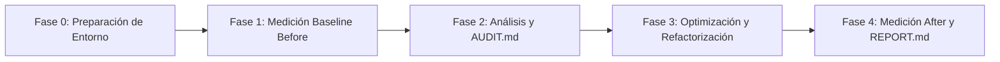

# Implementation Plan: Auditoría y Optimización de Rendimiento Frontend

## Objetivo
Ejecutar un ciclo profesional y riguroso de auditoría, optimización y refactorización de rendimiento frontend (**Medir → Analizar → Corregir → Volver a medir**) sobre el sitio corporativo (`/uis/website`) y el panel interno (`/uis/backoffice`). El plan resolverá cuellos de botella de **Core Web Vitals** (LCP, CLS, INP, TTFB), extraerá componentes duplicados en abstracciones reutilizables (o Custom Hooks) y generará la documentación técnica y evidencia de impacto en `AUDIT.md`, `REPORT.md` y la carpeta `/audit/`.

---

## 🧠 Reflexión y Análisis de Arquitectura (Pre-Planning / PACK 1 & 2)

Siguiendo el marco de trabajo de la **Code Refinement Suite** para proyectos de **Nivel 2/3 (Complejidad Media-Alta)**, se establecieron las directrices técnicas mediante el análisis de los 3 Expertos y exploración de soluciones:

### 1. Veredicto de los 3 Expertos
- **Performance & UX Specialist:**
  - *Métricas Críticas:* Prioridad absoluta en Core Web Vitals móviles: LCP (< 2.5s) optimizando Largest Contentful Element (imágenes hero con prioridad y formatos modernos WebP/AVIF), CLS (< 0.1) asignando dimensiones explícitas (`aspect-ratio` o `width`/`height`), y TTFB optimizando renders y caché.
  - *Prevención de regresiones:* La optimización de rendimiento no debe degradar la accesibilidad (WCAG) ni sacrificar la interactividad de la UI.
- **Frontend Lead Developer:**
  - *Refactorización Limpia:* Identificar duplicación entre `website` y `backoffice` (o dentro de cada app) y extraer componentes compartidos o Custom Hooks reutilizables sin alterar el comportamiento de negocio.
  - *Estrategia Next.js:* Aplicar `next/image`, `next/font` con `display: swap`, y `next/dynamic` (Lazy Loading) en componentes pesados fuera del viewport inicial para aligerar el First Load JS Bundle.
- **Security & Reliability Specialist:**
  - *Higiene y Control:* Ninguna optimización debe alterar la seguridad de autenticación JWT ni exponer endpoints de la API sin protección.
  - *Entrega Determinista:* Mantener la regla de un problema por commit para que cada mejora tenga trazabilidad y medición aislada.

### 2. Exploración Tree of Thoughts (ToT)
- **Rama A (Reescritura de vistas / arquitectura):** ❌ Descartada. Viola el brief técnico explícito ("No reestructures la arquitectura de ninguno de los frontends... El objetivo es la mejora, no una reescritura").
- **Rama B (Cambios superficiales en métricas):** ❌ Descartada. Inflar scores mediante hacks no resuelve las causas reales ni pasa la auditoría de calidad.
- **Rama C (Optimización dirigida basada en evidencia + Refactorización de hooks/componentes):** ✅ **Seleccionada.** Medición base rigurosa con Lighthouse → Análisis de causa raíz en `AUDIT.md` → Correcciones atómicas incrementales con tests → Validación final y balance en `REPORT.md`.

---

## 🗺️ Mapa de Trabajo por Fases (Roadmap)

Estado global: **[En Planificación / Listo para Ejecución]**

---

### 🛠️ Fase 0: Preparación de Entorno y Estructura de Auditoría
> **Estado:** `[Completado]`

- [x] **Paso 0.1:** Verificar que el entorno esté activo con ambos frontends accesibles:
  - Sitio Corporativo en `http://localhost:3000` (HTTP 200 OK)
  - Backoffice en `http://localhost:3001` (HTTP 200 OK)
  - Backend API operativo
- [x] **Paso 0.2:** Crear la estructura de directorios para almacenar las capturas de evidencia:
  - `mkdir -p audit/before audit/after`

---

### 📊 Fase 1: Medición Inicial (Baseline Before) con Lighthouse
> **Estado:** `[Completado]`

- [x] **Paso 1.1:** Ejecutar auditoría Lighthouse en **Sitio Corporativo** (`website`):
  - Modo Móvil: Performance 78, Accesibilidad 100, Best Practices 100, SEO 100.
  - Modo Escritorio: Performance 99, Accesibilidad 100, Best Practices 100, SEO 100.
- [x] **Paso 1.2:** Ejecutar auditoría Lighthouse en **Backoffice** (`/inventory/products`):
  - Modo Móvil: Performance 75, Accesibilidad 93, Best Practices 100, SEO 100.
  - Modo Escritorio: Performance 91, Accesibilidad 93, Best Practices 100, SEO 100.
- [x] **Paso 1.3:** Guardar las 4 capturas de pantalla en `audit/before/`:
  - `website-mobile-before.png`, `website-desktop-before.png`, `backoffice-mobile-before.png`, `backoffice-desktop-before.png`.
- [x] **Paso 1.4:** Realizar commit con las capturas iniciales en `audit/before`.

---

### 🔍 Fase 2: Análisis del Codebase y Redacción de `AUDIT.md`
> **Estado:** `[Completado]`

- [x] **Paso 2.1:** Analizar el código de `uis/website` y `uis/backoffice` para identificar causas raíz de degradación de rendimiento:
  - Imagen Hero en `website` con `` y `loading="lazy"` afectando LCP y CLS.
  - Ausencia de skeleton loader y accesibilidad de tablas en `backoffice`.
- [x] **Paso 2.2:** Identificar al menos **dos casos** de lógica o componentes duplicados candidatos a abstracción:
  - Caso 1: Custom Hook `useAsyncData` para peticiones con estados `loading`/`error`.
  - Caso 2: Componente modular `StockBadge`.
- [x] **Paso 2.3:** Redactar y crear el archivo `AUDIT.md` en la raíz con la matriz completa y diagnóstico.

---

### ⚡ Fase 3: Optimización Dirigida y Refactorización Incremental
> **Estado:** `[Pendiente]`

- [ ] **Paso 3.1:** Activar y seguir las directrices de las skills de optimización (`core-web-vitals`, `performance`, `web-perf`).
- [ ] **Paso 3.2:** Aplicar correcciones de **LCP y carga de recursos**:
  - Implementar `next/image` con tamaños responsivos (`sizes`), formatos modernos y `priority` sólo en imágenes hero.
  - Optimizar fuentes web (`font-display: swap`).
  - *Commit dedicado:* `git commit -m "perf: optimizacion de imagenes y carga de fuentes para LCP"`.
- [ ] **Paso 3.3:** Aplicar correcciones de **CLS (Cumulative Layout Shift)**:
  - Reservar espacio para elementos dinámicos e imágenes con aspect-ratio y dimensiones explícitas.
  - *Commit dedicado:* `git commit -m "perf: eliminacion de layout shifts mediante dimensiones explicitas"`.
- [ ] **Paso 3.4:** Aplicar correcciones de **JavaScript y Reducción de Bundle**:
  - Implementar imports dinámicos (`next/dynamic`) en componentes pesados fuera del viewport o modales diferidos.
  - *Commit dedicado:* `git commit -m "perf: code splitting y carga diferida de componentes pesados"`.
- [ ] **Paso 3.5:** Implementar la refactorización de código duplicado:
  - Extraer al menos un componente reutilizable o Custom Hook compartido.
  - Integrar la abstracción en ambos lugares correspondientes y verificar que la funcionalidad se mantenga al 100% intacta.
  - *Commit dedicado:* `git commit -m "refactor: extraccion e integracion de custom hook/componente reutilizable"`.

---

### 📈 Fase 4: Medición Final (After), `REPORT.md` y Validación Pre-Push
> **Estado:** `[Pendiente]`

- [ ] **Paso 4.1:** Ejecutar nuevamente Lighthouse bajo las mismas condiciones (mismas URLs, dispositivos Móvil y Escritorio).
- [ ] **Paso 4.2:** Guardar las nuevas capturas de pantalla con los resultados optimizados en `audit/after/`.
- [ ] **Paso 4.3:** Redactar el archivo `REPORT.md` en la raíz conteniendo:
  - Tabla comparativa de métricas Antes vs. Después (Performance, LCP, CLS, FID/INP, TTFB).
  - Resumen de cada optimización aplicada y análisis fáctico de cuál tuvo mayor impacto positivo.
  - Conclusiones y recomendaciones para mantener el rendimiento a futuro.
- [ ] **Paso 4.4:** Auditoría de calidad de código y ausencia de regresiones:
  - Ejecutar verificación de tipos (`npx tsc --noEmit`) y linting en ambos frontends.
  - Comprobar que no existan errores en la consola del navegador ni funcionalidades rotas.
- [ ] **Paso 4.5 (Regla Inviolable de Git):** Detener ejecución y solicitar confirmación explícita al usuario antes de cualquier `git push`.

---

## ⚙️ Métodos Aplicados (Code Refinement Suite)

Para este desafío se han integrado rigurosamente las técnicas de la **Code Refinement Suite**:

1. **PACK 1 (ARCHITECT) - Tree of Thoughts & 3 Expertos:**
   - Se descartó la reescritura arquitectónica en favor de una estrategia focalizada en Web Vitals (LCP, CLS, TTFB) y refactorización desacoplada, preservando la seguridad y la experiencia de usuario.
2. **PACK 2 (PLANNER) - Step-Back Prompting & Roadmap Interactivo:**
   - Se estructuró el flujo en 5 fases secuenciales con verificación paso a paso, checkboxes y trazabilidad commit-por-commit.
3. **PACK 3 (CODER) - Chain of Verification (CoVe) & Atomic Commits:**
   - Cada intervención de código atacará un problema específico con una medición inmediata en Lighthouse antes de pasar a la siguiente optimización.
4. **PACK 4 (AUDITOR) - WPO Checklist & Protocolo Git:**
   - Validación integral de entregables (`AUDIT.md`, `REPORT.md`, `/audit/before/`, `/audit/after/`) y parada obligatoria antes del `git push` final.
