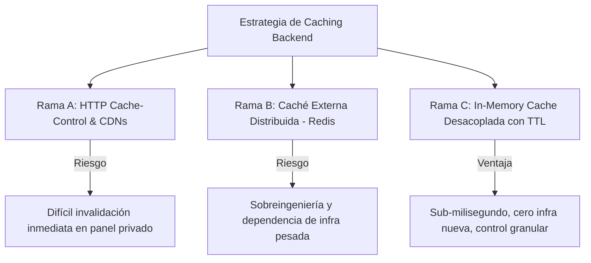

# 📋 Implementation Plan: Optimización de Rendimiento con Caching

Basado en las directrices de [.github/STRATEGY.md](STRATEGY.md) y desarrollado bajo la metodología **Code Refinement Suite**.

---

## 🧠 Reflexión Arquitectónica y Análisis de Decisiones (PACK 1: ARCHITECT & PACK 2: PLANNER)

### 1. Clasificación y Diagnóstico del Problema
- **Nivel de Criticidad asignado:** Nivel 2-3 (Complejidad Media-Alta).
- **Problema Detectado:** Telemetría con llamadas repetitivas idénticas a endpoints de lectura, latencias acumuladas en operaciones agregadas y re-renderizados costosos en vistas de datos del backoffice.
- **Premisa Central:** El caching no es una solución mágica para "tapar código lento", sino un compromiso explícito entre **coste de cómputo**, **frecuencia de acceso** y **frescura tolerable de los datos**.

---

### 2. Evaluación de Alternativas Técnicas: Tree of Thoughts (ToT)

| Alternativa | Ventajas | Desventajas / Riesgos | Decisión |
| :--- | :--- | :--- | :--- |
| **Rama A: Cabeceras HTTP (`Cache-Control`, ETag)** | Estándar web nativo; delega el almacenamiento en el cliente o proxy inverso. | Muy difícil de invalidar instantáneamente cuando un usuario del backoffice hace un cambio. Riesgo de mostrar datos viejos en operaciones críticas. | ❌ Descartada como solución primaria en el backend. |
| **Rama B: Caché Externa Distribuida (Redis)** | Excelente para clusters de múltiples réplicas y persistencia en memoria compartida. | Añade dependencia externa (contenedor Docker de Redis, configuración de red, overhead de serialización para datasets pequeños). | ❌ Descartada por sobreingeniería en el estado actual. |
| **Rama C: In-Memory Cache Desacoplada con TTL y Tag/Key Invalidation** | Latencia ultra baja (<0.5ms), sin dependencias externas, control absoluto de invalidación síncrona. | Limitada al ciclo de vida del proceso y memoria de la instancia. | ✅ **Seleccionada.** Se diseñará con una interfaz limpia que permita migrar a Redis en el futuro sin tocar los endpoints. |

---

### 3. Deliberación de los Tres Expertos

#### 🛠️ Lead Developer (Rendimiento & Mantenibilidad)
> *"Para que la caché aporte valor real y medible en los logs, necesitamos volumen de datos. En una tabla con 3 registros, cualquier consulta tarda 1ms y no hay nada que demostrar. Debemos empezar construyendo un **seeder realista** y midiendo la línea base antes de tocar nada. Además, la invalidación debe ser inmediata: si alguien crea o edita un registro vía POST/PUT, el listado en caché debe purgarse en el mismo ciclo."*

#### 🔒 Security Specialist (Auth Guard & Aislamiento de Datos)
> *"El mayor peligro del caching en una API con autenticación es la **fuga de datos por clave compartida**. Si un endpoint devuelve información contextual al usuario (perfiles, pedidos asignados), la clave de caché NUNCA puede ser estática como `inventory_orders`. O bien no se cachea, o la clave debe incluir el identificador del usuario (`f'orders:{current_user[\"id\"]}'`). Los datos públicos o globales de catálogo sí pueden compartir clave."*

#### 🎨 UX/UI Lead (Interactividad & Bundle Size)
> *"En Next.js no podemos bloquear el renderizado inicial descargando código que el usuario tal vez nunca use (como modales de creación o paneles analíticos pesados). El **Lazy Loading (`next/dynamic`)** debe aplicarse a componentes pesados bajo demanda. Por su parte, **`useMemo`** debe reservarse estrictamente para operaciones de cálculo intensivo (agrupaciones, filtros complejos de tablas) con un array de dependencias exhaustivo."*

---

### 4. Self-Refinement Loop (3 Ciclos de Refinamiento del Plan)
1. **Ciclo 1 (Verificabilidad con evidencia):**  
   *Pregunta:* ¿Cómo probamos que la caché funciona y no es solo teoría?  
   *Ajuste al plan:* Añadir una fase previa obligatoria de **Seeder de Datos** y **Middleware de timing** para obtener métricas numéricas contrastables (Pre vs. Post).
2. **Ciclo 2 (Consistencia e Invalidación):**  
   *Pregunta:* ¿Qué ocurre si un dato cambia mientras la caché está viva?  
   *Ajuste al plan:* El plan debe incluir explícitamente la invalidación en las rutas de escritura (`POST`, `PUT`, `DELETE`), evitando que los datos queden obsoletos antes del TTL.
3. **Ciclo 3 (Adherencia al Monorepo y Modo Tutor):**  
   *Pregunta:* ¿Cómo ejecutamos esto de acuerdo con las directrices globales?  
   *Ajuste al plan:* Toda ejecución se realiza con `uv run`, respetando el estándar `Auth Guard`, y avanzando de forma pedagógica paso a paso con el usuario al volante.

---

## 🗺️ Mapa de Trabajo por Fases (Roadmap)

### Fase 1: Medición de Línea Base y Datos Realistas
- [x] **1.1 Middleware de Telemetría:** Corregir y activar el `timing_middleware` en `services/api/main.py` para medir la latencia real por endpoint.
- [x] **1.2 Seeder de Datos de Carga:** Crear y ejecutar `scripts/seed_caching_data.py` con `uv run` para poblar la base de datos con volumen y variabilidad realistas.
- [x] **1.3 Medición Inicial (Pre-Cache):** Probar los endpoints candidatos en ráfaga y registrar las latencias basales en milisegundos.

### Fase 2: Backend Caching & Invalidación (FastAPI)
- [x] **2.1 Módulo Core de Caché:** Implementar un gestor de caché en memoria con TTL (`services/api/cache.py` o módulo compartido) que soporte invalidación por tags/claves y aislamiento por usuario.
- [x] **2.2 Caché en Endpoint 1 (Lectura frecuente/costosa):** Aplicar decorador/estrategia de caché en `/inventory/items` o `/inventory/orders`.
- [x] **2.3 Caché en Endpoint 2 (Agregaciones/Estabilidad):** Aplicar caché en `/suppliers` o agregaciones de `/incidents`.
- [x] **2.4 Estrategia de Invalidación:** Conectar las mutaciones (`POST`, `PUT`, `DELETE`) para purgar automáticamente las claves cacheadas relacionadas.
- [x] **2.5 Validación y Remediación:** Medir latencias post-cache y comprobar que los datos se refrescan inmediatamente tras una mutación.

### Fase 3: Frontend Caching & Optimización (Next.js)
- [x] **3.1 Identificación de Componentes Pesados:** Inspeccionar bundle y vistas de `uis/backoffice` y `uis/website`.
- [x] **3.2 Lazy Loading (Componente 1):** Implementar carga diferida con `next/dynamic` (ej. modales de creación o componentes de formularios complejos).
- [x] **3.3 Lazy Loading (Componente 2):** Implementar carga diferida en un segundo componente/vista no crítico para el primer render.
- [x] **3.4 Optimización con `useMemo`:** Localizar un cálculo/filtrado costoso en tablas o listados y memoizarlo con dependencias estrictas.

### Fase 4: Auditoría, Seguridad y Reporte
- [x] **4.1 Red Teaming de Seguridad:** Validar que ninguna clave de caché filtre información sensible o privada entre usuarios distintos.
- [x] **4.2 Redacción de `CACHING_REPORT.md`:** Documentar decisiones frontend, decisiones backend, análisis del compromiso frescura vs. rendimiento, y justificación de lo que NO se cacheó.
- [x] **4.3 Verificación Final y Checklist de Evaluación:** Revisar el cumplimiento de todos los puntos de evaluación de `STRATEGY.md`.

---

## ⚙️ Métodos Aplicados (Code Refinement Suite)

1. **Step-Back Prompting (Abstracción en PLANNER):** Se desacopla la lógica de almacenamiento temporal de los controladores de ruta para permitir cambiar el backend de caché (de memoria a Redis en el futuro) sin modificar las rutas.
2. **Chain of Verification (CoVe en CODER):** Cada cambio de endpoint cacheado se verificará comparando: (a) datos retornados coinciden con DB, (b) tiempo de respuesta se reduce drásticamente en segunda llamada, (c) tras un `POST`/`PUT` la respuesta refleja el cambio inmediatamente.
3. **Red Teaming (en AUDITOR):** Simulación de peticiones cruzadas entre usuarios autenticados para garantizar que el Auth Guard estándar del proyecto no se rompa por claves de caché compartidas inadvertidamente.
