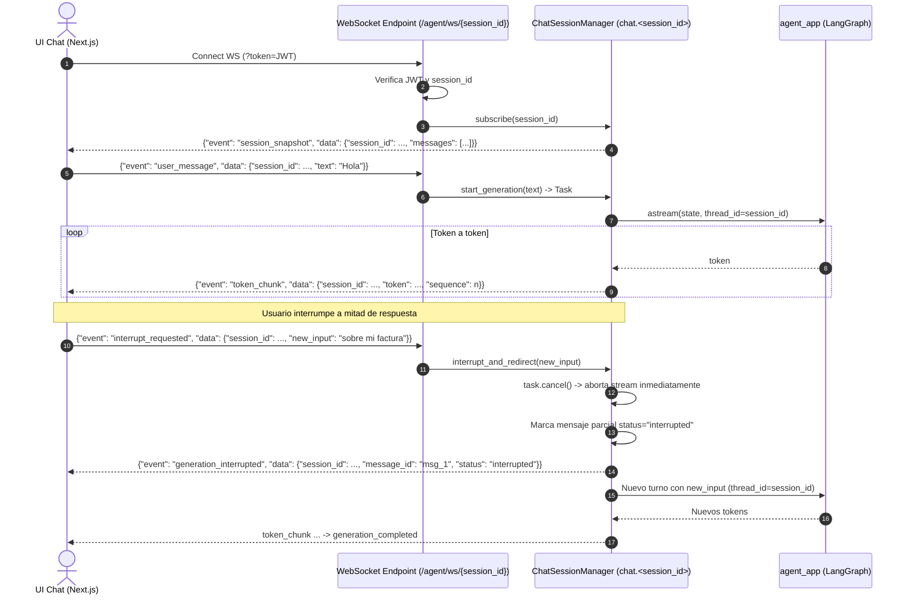

# Implementation Plan: Sistemas en Tiempo Real — Streaming de Chat por WebSocket (Parte 2 de 2)

**Nivel de Complejidad:** Nivel 3 (Arquitectura Bidireccional — WebSocket Pub/Sub, Streaming Token-a-Token, Abort Real y Rehidratación)  
**Rama de Trabajo:** `feature/websocket-chat`  
**Documentos de Referencia:** `.github/STRATEGY.md`, `BRIEFING (real-time-communication)`, `AGENTS.md`, `services/agent/graph.py`, `services/api/routes/agent.py`

---

## 1. 📐 PACK 1: ARCHITECT (Ideación y Decisión Técnica)

### 1.1 Árbol de Pensamiento (Tree of Thoughts - ToT)
Se evaluaron tres opciones para lograr streaming token-a-token e interrupción en tiempo real del agente `first_line_support`:

- **Rama A (SSE para salida + `POST /agent/abort` por HTTP separado):**
  - *Ventajas:* Reutiliza SSE de la Parte 1.
  - *Riesgos:* Dos canales separados introducen condiciones de carrera entre el stream de lectura y el endpoint de abort; no cumple el criterio de aceptación de `STRATEGY.md` ("el canal debe ser bidireccional", "SSE ya no alcanza"). **Descartada.**
- **Rama B (Usar LangGraph `interrupt()` HITL para detener respuestas):**
  - *Ventajas:* Mecanismo nativo de grafos.
  - *Riesgos:* Viola explícitamente `STRATEGY.md`: LangGraph `interrupt()` pausa nodos entre transiciones esperando aprobación humana, **no** cancela un stream de tokens en vuelo. **Descartada.**
- **Rama C (WebSocket Bidireccional + Pub/Sub por Sesión `chat.<session_id>` + Cancelación de `asyncio.Task` - Elegida):**
  - *Ventajas:*
    1. Canal único full-duplex: el cliente envía `user_message` e `interrupt_requested` mientras recibe `token_chunk` concurrentemente.
    2. Desacopla al productor (ejecución del grafo `agent_app`) de los consumidores (múltiples clientes WebSocket suscritos a `chat.<session_id>`), permitiendo observadores/supervisores en vivo sin duplicar llamadas al agente.
    3. Al recibir `interrupt_requested`, cancela la `asyncio.Task` en vuelo (`task.cancel()`), abortando genuinamente el stream sin emitir más `token_chunk`, conservando el mensaje parcial como `interrupted` y arrancando un turno nuevo con `new_input`.
    4. No modifica la lógica interna ni las herramientas de `services/agent/graph.py` ni `services/agent/nodes.py`.

---

### 1.2 Análisis del Panel de 3 Expertos

#### 1. UX / Product Specialist
- **Efecto de escritura en vivo:** El asistente muestra un indicador de escritura y va añadiendo cada `token_chunk` conforme llega, sin reemplazar todo el mensaje al final.
- **Control de interrupción natural:** Mientras el agente responde, el usuario puede enviar un nuevo mensaje o pulsar "Interrumpir y redirigir". El mensaje parcial del asistente permanece visible en el historial con un badge `"Interrumpido"` (`status: "interrupted"`), y la respuesta redirigida aparece debajo como un turno nuevo.
- **Reconexión transparente:** Si se pierde la red, la UI muestra `"Reconectando..."` con backoff exponencial, reconecta usando el mismo `session_id` y recibe `session_snapshot` para restaurar la conversación completa sin perder el hilo.

#### 2. Dev Lead / Software Architect
- **Gestor Pub/Sub y Sesiones (`services/api/ws_chat_manager.py`):**
  - Entidad `ChatSession` alineada al BRIEFING: `session_id`, `agent_id="first_line_support"`, `user_id`, `client_id`, `status` (`"active" | "interrupted" | "closed"`), `created_at` y lista ordenada de mensajes (`message_id`, `role`, `content`, `status`, `created_at`).
  - Canal `chat.<session_id>` con conjunto de suscriptores (`WebSocket` / `asyncio.Queue`), garantizando broadcast único por sesión sin duplicar ejecuciones del agente.
  - Control de tarea activa (`active_task: asyncio.Task`) por sesión: cuando llega `interrupt_requested`, se cancela la tarea activa, se espera su cierre limpio, se marca el mensaje parcial como `interrupted`, se publica `generation_interrupted` y se lanza un turno nuevo si `new_input` está presente.
- **Adaptador de Streaming para `agent_app` (`services/api/routes/agent.py`):**
  - Invoca `agent_app.astream(initial_state, config={"configurable": {"thread_id": session_id}}, stream_mode=["messages", "updates"])` sin alterar `services/agent/`.
  - Si un nodo emite `AIMessageChunk` nativos, se transmiten token a token; si un nodo determinista/RAG (`generate_answer`, `format_tool_answer`, `honest_refusal`, `tool_fallback`) entrega el texto completo en `updates`, el adaptador lo divide en tokens y lo emite progresivamente con puntos de suspensión `await asyncio.sleep(...)` para que `task.cancel()` aborte instantáneamente entre tokens.

#### 3. Security & Compliance Specialist (Auth Guard Standard)
- **Autenticación en Handshake WebSocket:**
  - Extrae el JWT desde `?token=...` en la URL del handshake (y opcionalmente soporta un primer frame `{ "event": "auth", "data": { "token": "..." } }` si no vino en query string).
  - Valida el JWT con la misma lógica/clave de `services/api/routes/auth.py` (`decode_access_token` / `SECRET_KEY`). Si falta o es inválido, cierra inmediatamente el socket con código `1008` (Policy Violation) antes de emitir `session_snapshot` o aceptar eventos.
- **Exigencia de `session_id`:** Requerido en el handshake (`/agent/ws/{session_id}` o `?session_id=...`).

---

### 1.3 Threat Modeling & FMEA

| Amenaza / Modo de Fallo | Riesgo / Impacto | Severidad | Mitigación Técnica |
| :--- | :--- | :---: | :--- |
| **Acceso sin JWT al WebSocket** | Cualquiera lee o interactúa con sesiones de soporte de clientes. | Crítica | Validación estricta del mismo JWT de `auth.py` en el handshake; cierre inmediato (`1008`) antes de enviar `session_snapshot`. |
| **Tokens "zombies" tras interrupción** | Llegan `token_chunk` de la respuesta vieja mezclados con la nueva. | Alta | Cancelación explícita de `asyncio.Task` + verificación de `generation_id` / `message_id` antes de publicar en `chat.<session_id>`, y espera (`await`) a que la tarea anterior termine antes de iniciar el nuevo turno. |
| **Desincronización tras caída de red** | Al reconectar, el chat aparece vacío y se pierde el contexto. | Alta | Emisión automática de `session_snapshot` al completar el handshake con todo el historial (`messages`, incluyendo mensajes `interrupted`) y uso del mismo `session_id` como `thread_id` de LangGraph. |
| **Múltiples observadores duplicando al agente** | 2 pestañas abiertas en la misma sesión ejecutan 2 veces al agente. | Alta | Productor único desacoplado en `ChatSessionManager`: solo la recepción de `user_message` / `interrupt_requested` dispara el productor, que publica en `chat.<session_id>` hacia todos los sockets suscritos. |

---

## 2. 📝 PACK 2: PLANNER (Contrato de Datos y Flujo)

### 2.1 Contrato WebSocket (`BRIEFING` Parte 2)

#### Entidad `ChatSession`
```python
class ChatSession(BaseModel):
    session_id: str
    agent_id: str = "first_line_support"
    user_id: str
    client_id: Optional[str] = None
    status: Literal["active", "interrupted", "closed"] = "active"
    created_at: str
```

#### Eventos Cliente → Servidor
- `user_message`:
  ```json
  {"event": "user_message", "data": {"session_id": "chat_0157", "text": "..."}}
  ```
- `interrupt_requested`:
  ```json
  {"event": "interrupt_requested", "data": {"session_id": "chat_0157", "new_input": "en realidad mi pregunta era sobre la factura"}}
  ```

#### Eventos Servidor → Cliente
- `session_snapshot` (al conectar/reconectar):
  ```json
  {"event": "session_snapshot", "data": {"session_id": "chat_0157", "messages": []}}
  ```
- `token_chunk`:
  ```json
  {"event": "token_chunk", "data": {"session_id": "chat_0157", "token": "Claro", "sequence": 4}}
  ```
- `generation_interrupted`:
  ```json
  {"event": "generation_interrupted", "data": {"session_id": "chat_0157", "message_id": "msg_0321", "status": "interrupted"}}
  ```
- `generation_completed`:
  ```json
  {"event": "generation_completed", "data": {"session_id": "chat_0157", "message_id": "msg_0322"}}
  ```

### 2.2 Diagrama de Secuencia (Streaming + Interrupción)


```mermaid
sequenceDiagram
    autonumber
    actor Cliente as UI Chat (Next.js)
    participant WS as WebSocket Endpoint (/agent/ws/{session_id})
    participant PubSub as ChatSessionManager (chat.<session_id>)
    participant Agent as agent_app (LangGraph)

    Cliente->>WS: Connect WS (?token=JWT)
    WS->>WS: Verifica JWT y session_id
    WS->>PubSub: subscribe(session_id)
    PubSub-->>Cliente: {"event": "session_snapshot", "data": {"session_id": ..., "messages": [...]}}

    Cliente->>WS: {"event": "user_message", "data": {"session_id": ..., "text": "Hola"}}
    WS->>PubSub: start_generation(text) -> Task
    PubSub->>Agent: astream(state, thread_id=session_id)
    loop Token a token
        Agent-->>PubSub: token
        PubSub-->>Cliente: {"event": "token_chunk", "data": {"session_id": ..., "token": ..., "sequence": n}}
    end

    Note over Cliente,PubSub: Usuario interrumpe a mitad de respuesta
    Cliente->>WS: {"event": "interrupt_requested", "data": {"session_id": ..., "new_input": "sobre mi factura"}}
    WS->>PubSub: interrupt_and_redirect(new_input)
    PubSub->>PubSub: task.cancel() -> aborta stream inmediatamente
    PubSub->>PubSub: Marca mensaje parcial status="interrupted"
    PubSub-->>Cliente: {"event": "generation_interrupted", "data": {"session_id": ..., "message_id": "msg_1", "status": "interrupted"}}
    PubSub->>Agent: Nuevo turno con new_input (thread_id=session_id)
    Agent-->>PubSub: Nuevos tokens
    PubSub-->>Cliente: token_chunk ... -> generation_completed
```

---

## 3. 💻 PACK 3: CODER (Mapa de Implementación Paso a Paso)

1. **Backend — Auth helper + Gestor Pub/Sub (`services/api/ws_chat_manager.py`):**
   - Modelo `ChatSession` y `ChatMessage` con los campos exactos del BRIEFING.
   - `ChatSessionManager` con canales `chat.<session_id>`, registro de múltiples suscriptores WebSocket, historial en memoria para `session_snapshot`, y cancelación segura de `asyncio.Task` para abort real.
2. **Backend — Endpoint WebSocket en `services/api/routes/agent.py`:**
   - Reutilizar/exponer validación JWT en `services/api/routes/auth.py` (si no existe función pública reutilizable para WS).
   - Añadir `@router.websocket("/ws/{session_id}")` en `services/api/routes/agent.py` conectado al `ChatSessionManager` y `agent_app`.
3. **Pruebas Automatizadas (`tests/api/test_websocket_chat.py`):**
   - Test 1: Rechazo sin JWT válido.
   - Test 2: Handshake con `session_id` devuelve `session_snapshot`.
   - Test 3: Flujo `user_message` → múltiples `token_chunk` → `generation_completed`.
   - Test 4: Flujo `interrupt_requested` a mitad de respuesta → aborta generación (`generation_interrupted` con `status="interrupted"`), no emite más tokens del turno viejo, conserva mensaje parcial y arranca nuevo turno con `new_input`.
   - Test 5: Reconexión con el mismo `session_id` restaura el historial completo en `session_snapshot`.
   - Test 6: Múltiples clientes suscritos a `chat.<session_id>` reciben los mismos eventos sin duplicar invocaciones al agente.
4. **Frontend — Hook + Interfaz de Chat en Tiempo Real (`uis/backoffice/src/hooks/useSupportChatWS.ts` y `uis/backoffice/src/app/support-chat/page.tsx` o integración en `knowledge`):**
   - Cliente WebSocket con `?token=...`, `session_id` persistente, streaming token-a-token en vivo, control de interrupción/redirección dejando visible el mensaje marcado como `interrupted`, y reconexión exponencial con rehidratación automática desde `session_snapshot`.
   - Enlace de navegación desde el Backoffice para acceder directamente al Chat de Soporte en Vivo.

---

## 4. 🛡️ PACK 4: AUDITOR (Verificación y Preguntas de Diseño PR)

- **Comandos de verificación:**
  - `uv run pytest tests/api/test_websocket_chat.py -v`
  - `cd uis/backoffice && npx tsc --noEmit`
- **Protocolo Git:**
  - Rama `feature/websocket-chat` desde `main`.
  - ⚠️ **Regla Inviolable:** NUNCA realizar `git push` automático sin consentimiento explícito del usuario.

---

## 🗺️ Mapa de Trabajo por Fases (Roadmap)

### Fase 1: Gestor Pub/Sub y Sesiones WebSocket (`services/api/ws_chat_manager.py`)
- [ ] 1.1 Definir modelos Pydantic del contrato (`ChatSession`, `ChatMessage`) alineados al BRIEFING de Nexova (`agent_id="first_line_support"`, `status`: `active | interrupted | closed`).
- [ ] 1.2 Implementar `ChatSessionManager` con canales Pub/Sub `chat.<session_id>` desacoplando al productor del agente de múltiples consumidores WebSocket.
- [ ] 1.3 Implementar historial por sesión y generación de `session_snapshot` para rehidratación en reconexión.
- [ ] 1.4 Implementar cancelación de tarea en vuelo (`asyncio.Task.cancel()`) para abortar genuinamente la generación ante `interrupt_requested`, marcando el mensaje parcial como `interrupted` y lanzando el nuevo turno con `new_input`.

### Fase 2: Endpoint WebSocket y Adaptador LangGraph (`services/api/routes/agent.py`)
- [ ] 2.1 Validar el mismo JWT del backoffice en el handshake WebSocket (`?token=...` o primer frame `auth`) usando `get_current_user` de `services/api/routes/auth.py` (cierre `1008` si falta o es inválido).
- [ ] 2.2 Exigir `session_id` en la ruta `/agent/ws/{session_id}` y usarlo como `thread_id` en LangGraph `agent_app.astream(...)`.
- [ ] 2.3 Implementar adaptador de streaming token-a-token para `agent_app` (sin modificar `services/agent/graph.py` ni sus herramientas) emitiendo `token_chunk`, `generation_completed` y `generation_interrupted`.

### Fase 3: Pruebas Automatizadas (`tests/api/test_websocket_chat.py`)
- [ ] 3.1 Verificar rechazo del handshake sin JWT válido.
- [ ] 3.2 Verificar emisión de `session_snapshot` al conectar con `session_id`.
- [ ] 3.3 Verificar flujo `user_message` → `token_chunk` (secuenciales) → `generation_completed`.
- [ ] 3.4 Verificar flujo `interrupt_requested` a mitad de stream → abort real (`generation_interrupted` con `status="interrupted"`, cero tokens residuales, conservación del mensaje parcial y nuevo turno reflejando `new_input`).
- [ ] 3.5 Verificar reconexión con el mismo `session_id` restaurando el hilo completo y difusión Pub/Sub a múltiples observadores sin duplicar invocaciones al agente.

### Fase 4: Interfaz de Chat en Tiempo Real (`uis/backoffice/`)
- [ ] 4.1 Crear hook `uis/backoffice/src/hooks/useSupportChatWS.ts` con `WebSocket`, `?token=...`, `session_id` persistente, reconexión con backoff exponencial y rehidratación desde `session_snapshot`.
- [ ] 4.2 Crear vista de chat de soporte (`uis/backoffice/src/app/support-chat/page.tsx`) con renderizado de tokens en vivo, botón/flujo de interrupción y redirección en mitad de respuesta, y badge visible de `interrupted`.
- [ ] 4.3 Añadir enlace de navegación en el Backoffice y validar compilación TypeScript (`cd uis/backoffice && npx tsc --noEmit`).

### Fase 5: Auditoría Final y Protocolo Git (PACK 4)
- [ ] 5.1 Verificar que `services/agent/` (lógica interna y herramientas) permanece intacto y no se mezclan payloads RFP/SSE de la Parte 1.
- [ ] 5.2 Ejecutar `uv run pytest tests/api/test_websocket_chat.py -v` y `npx tsc --noEmit` tras el último cambio.
- [ ] 5.3 Solicitar consentimiento explícito del usuario antes de realizar `git push` hacia `feature/websocket-chat`.

---

## ⚙️ Métodos Aplicados (Code Refinement Suite)

1. **Tree of Thoughts (ToT):** Comparativa formal entre SSE+HTTP abort, LangGraph HITL `interrupt()`, y WebSocket bidireccional con Pub/Sub + cancelación de `asyncio.Task`.
2. **Panel de 3 Expertos (UX, Dev Lead, Security):** Equilibrio entre escritura en vivo + visibilidad de mensajes `interrupted`, desacoplamiento productor/consumidor en `chat.<session_id>`, y validación JWT estricta en handshake.
3. **Threat Modeling & FMEA:** Mitigación de acceso no autorizado (`1008`), tokens zombies tras interrupción (`task.cancel()` + espera explícita), pérdida de contexto en reconexión (`session_snapshot`), y duplicación de agente ante múltiples observadores.
4. **Chain of Verification (CoVe) & Wiring Check:** Contrastado contra `services/agent/graph.py`, `services/agent/nodes.py`, `data/pipelines/rag.py`, y `services/api/routes/auth.py`.
5. **Test-Driven Refinement (TDD):** Pruebas automatizadas de contrato WebSocket (`token_chunk`, `generation_interrupted`, `generation_completed`, `session_snapshot`) y reconexión antes de cerrar el ciclo.

