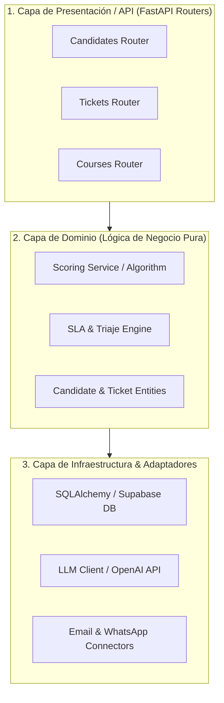
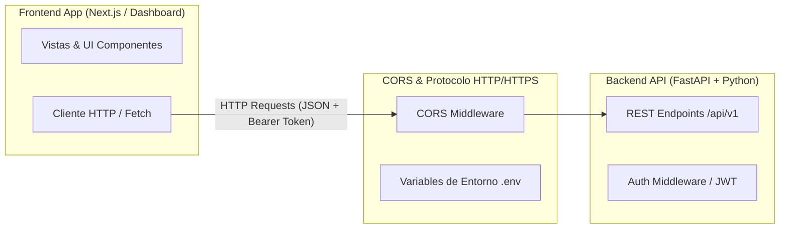

# 🏛️ Propuesta de Arquitectura de Backend — Nexova Solutions

**Documento:** Propuesta de Arquitectura de Backend y Diseño del Sistema  
**Autor:** Equipo de AI Engineering  
**Destinatario:** Sergio Molina (CTO) & Laura Mendoza (CEO) — Nexova Solutions  
**Fecha:** 26 de Agosto, 2026  
**Ubicación:** `docs/ARCHITECTURE_PROPOSAL.md`  

---

## 🎯 1. Resumen Ejecutivo y Contexto del Negocio

**Nexova Solutions** es una consultora de recursos humanos, selección de talento, soporte al cliente externalizado y formación corporativa con 120 empleados y presencia en Valencia y Miami. En el hito anterior, desplegamos exitosamente el panel corporativo unificado (`nexova-departamentos-panel.html`), centralizando en el frontend los módulos de:
- **Operaciones de Selección (Javier Almeida):** Ranking y scoring inteligente de candidatos (0 a 100) para cribado de CVs.
- **Soporte al Cliente Externalizado (Roberto Díaz):** Triaje de incidencias, tickets en tiempo real y asistencia por chatbot.
- **Formación Corporativa, Ventas y RRHH:** Vistas operativas y catálogos de servicios.

Actualmente, estos módulos operan en el cliente con datos persistidos de forma volátil (`localStorage` o scripts locales). Para permitir que Nexova opere a escala, procese miles de candidaturas y gestione tickets bajo acuerdos de nivel de servicio (SLA) rigurosos, **es imprescindible construir un backend robusto, mantenible, desacoplado y de alto rendimiento**.

Este documento establece la visión arquitectónica del backend utilizando **Python** y **FastAPI**, fundamentando cada decisión técnica en las necesidades operativas de Nexova Solutions y anticipando los riesgos de implementación.

---

## 📐 2. Selección y Justificación del Patrón Arquitectónico

### Patrón Seleccionado: **Arquitectura Hexagonal (Puertos y Adaptadores) / Capas Orientada a Dominios (Domain-Driven Layers)**

Tras un análisis comparativo de alternativas (Monolito MVC tradicional, Microservicios puros y Serverless FaaS), hemos seleccionado una **Arquitectura en Capas Orientada a Dominios (Clean / Hexagonal Architecture)**.



### Justificación vinculada a las necesidades reales de Nexova Solutions

1. **Aislamiento de la Lógica de IA y Scoring (Operaciones de Selección):**
   El cálculo del `score_ia` (0-100) para cribado de CVs y el análisis semántico de experiencia son algoritmos propietarios de la empresa. Separar la lógica de dominio de las rutas HTTP y de la infraestructura (modelos LLM de OpenAI u otros) permite actualizar o cambiar el proveedor de IA sin alterar la API REST ni el esquema de la base de datos.
2. **Cumplimiento de SLAs y Resiliencia (Soporte al Cliente):**
   El área de Soporte maneja incidencias críticas con tiempos de respuesta estrictos. Al separar la capa de servicios de los adaptadores de infraestructura, podemos introducir colas de mensajería (Celery/Redis) para el triaje asíncrono sin reescribir la lógica de negocio de los tickets.
3. **Escalabilidad Gradual sin Sobrecarga de Microservicios:**
   Con un equipo de tecnología de 6 personas (liderado por Sergio Molina), una arquitectura de microservicios distribuidos añadiría una complejidad operativa inasumible (tráficos de red, despliegues múltiples, orquestación de Kubernetes). La arquitectura en capas organizada por dominios dentro de un **Monolito Modular** ofrece la separación adecuada sin la sobrecarga de infraestructura.

---

## 📁 3. Estructura de Carpetas y Módulos del Proyecto

Proponemos una estructura clara donde la aplicación viva dentro del directorio `backend/` del monorepo, organizada por **dominios de negocio (feature-first / domain-first)** combinada con separación limpia de capas:

```
backend/
├── app/
│   ├── main.py                     # Punto de entrada principal (Instancia FastAPI)
│   ├── config.py                   # Gestión de configuración y variables de entorno (Pydantic Settings)
│   ├── dependencies.py             # Inyección de dependencias globales (DB session, auth)
│   │
│   ├── core/                       # Núcleo compartido del sistema
│   │   ├── database.py             # Conexión SQLAlchemy / Engine DB
│   │   ├── security.py             # Hashing de contraseñas, tokens JWT
│   │   └── exceptions.py           # Manejadores de excepciones globales y errores HTTP
│   │
│   ├── domains/                    # Módulos aislados por Dominio de Negocio
│   │   │
│   │   ├── candidates/             # DOMINIO: Operaciones de Selección (Javier Almeida)
│   │   │   ├── router.py           # Endpoints HTTP (FastAPI APIRouter)
│   │   │   ├── schemas.py          # Validadores DTO (Pydantic models)
│   │   │   ├── models.py           # Entidades de base de datos (SQLAlchemy models)
│   │   │   ├── service.py          # Lógica de negocio (Cálculo de score_ia, ranking)
│   │   │   └── repository.py       # Consultas a Base de Datos
│   │   │
│   │   ├── support/                # DOMINIO: Soporte al Cliente & Triaje (Roberto Díaz)
│   │   │   ├── router.py           # Endpoints de Tickets y Chatbot
│   │   │   ├── schemas.py          # DTOs de Tickets, Transcripciones y Triaje
│   │   │   ├── models.py           # Tablas de Tickets, Clientes e Incidencias
│   │   │   ├── service.py          # Reglas de SLAs, triaje automático e escalado
│   │   │   └── repository.py       # Acceso a datos de soporte
│   │   │
│   │   ├── training/               # DOMINIO: Formación Corporativa (Elena Vargas)
│   │   │   ├── router.py           # Endpoints de Cursos e Inscripciones
│   │   │   ├── schemas.py          # DTOs de Cursos y Usuarios
│   │   │   ├── models.py           # Tablas de Cursos y Certificados
│   │   │   └── service.py          # Lógica de matrícula y expedición
│   │   │
│   │   └── users/                  # DOMINIO: Autenticación e Identidad (120 empleados)
│   │       ├── router.py           # Login, perfil, gestión de roles
│   │       ├── schemas.py          # DTOs de login y tokens
│   │       ├── models.py           # Tabla de Usuarios y Roles (Consultor, Agente, Admin)
│   │       └── service.py          # Lógica de autenticación
│   │
│   └── integrations/               # Conectores a servicios externos
│       ├── ai_provider.py          # Integración con cliente LLM (OpenAI / LangChain)
│       └── email_service.py        # Envío de notificaciones por email
│
├── tests/                          # Tests automatizados (Pytest)
│   ├── unit/                       # Tests unitarios de servicios y dominio
│   └── integration/                # Tests de endpoints HTTP y base de datos
│
├── .env.example                    # Plantilla de variables de entorno requeridas
├── Dockerfile                      # Imagen Docker de producción
└── requirements.txt                # Dependencias de Python (FastAPI, Uvicorn, Pydantic, SQLAlchemy)
```

### Criterio de Separación Utilizado
- **Feature-First / Domain-Driven:** En lugar de agrupar todos los archivos por tipo (`controllers/`, `views/`, `models/`), cada área de negocio de Nexova (`candidates`, `support`, `training`) posee su propio paquete autosuficiente. Esto permite que un desarrollador trabajando en el módulo de Selección no interfiera con la lógica de Soporte.
- **Independencia de Infraestructura:** La subcarpeta `integrations/` aísla los SDKs externos (OpenAI, servicios de email) para que la lógica interna de los dominios consuma interfaces neutras.

---

## 🚦 4. Organización de Endpoints y Routers en FastAPI

Para reflejar una aplicación FastAPI profesional y mantenible, utilizaremos **`APIRouter`** para modularizar las rutas por dominio e incluirlos en el archivo principal `app/main.py`.

### Prefijos de Rutas y Estructura RESTful

#### A. Dominio: Operaciones de Selección (`/api/v1/candidates`)
- `GET /api/v1/candidates/`: Listado de candidaturas con filtros por experiencia, puesto, estado y ordenación por `score_ia`.
- `GET /api/v1/candidates/{id}`: Detalle completo de un candidato (CV, teléfono, desglose del scoring de la IA).
- `POST /api/v1/candidates/`: Creación/Carga de nuevo candidato.
- `POST /api/v1/candidates/{id}/score`: Desencadenar recálculo asíncrono del `score_ia` mediante análisis de IA.
- `PATCH /api/v1/candidates/{id}/status`: Actualización rápida de estado (Criba, Entrevista, Oferta, Rechazado).
- `POST /api/v1/candidates/{id}/notes`: Añadir nota interna del consultor de selección.

#### B. Dominio: Soporte al Cliente & Triaje (`/api/v1/support`)
- `GET /api/v1/support/tickets`: Listado de tickets con métricas de SLA y filtro de prioridad (Alta, Media, Baja).
- `GET /api/v1/support/tickets/{id}`: Detalle del ticket con transcripción del chat y datos del cliente.
- `POST /api/v1/support/tickets`: Creación de ticket desde la interacción inicial con el chatbot.
- `POST /api/v1/support/tickets/{id}/triage`: Análisis por IA del nivel de urgencia e imputación automática de departamento.
- `PATCH /api/v1/support/tickets/{id}/status`: Cambio de estado (Abierto, En Proceso, Resuelto, Escalado).
- `POST /api/v1/support/chat/message`: Endpoint para la conversación fluida del chatbot de atención inicial.

#### C. Dominio: Formación Corporativa (`/api/v1/training`)
- `GET /api/v1/training/courses`: Catálogo público y corporativo de cursos disponibles.
- `POST /api/v1/training/enrollments`: Registro de empleados/clientes en un programa formativo.

### Integración en `main.py`
En el archivo principal, los routers se incluyen con versión explícita:
```python
from fastapi import FastAPI
from app.domains.candidates.router import router as candidates_router
from app.domains.support.router import router as support_router
from app.domains.training.router import router as training_router

app = FastAPI(title="Nexova Solutions API", version="1.0.0")

app.include_router(candidates_router, prefix="/api/v1/candidates", tags=["Candidates"])
app.include_router(support_router, prefix="/api/v1/support", tags=["Support & Triaje"])
app.include_router(training_router, prefix="/api/v1/training", tags=["Training"])
```

---

## 🔍 5. Convenciones Estándar de FastAPI e Investigación

Basándonos en la investigación de las convenciones de la comunidad de FastAPI (como las plantillas oficiales de Tiangolo y el patrón *FastAPI Best Practices*), documentamos cómo estas decisiones influyen en el diseño de Nexova:

1. **Modelos Pydantic (DTOs) vs. Modelos SQLAlchemy (ORM):**
   - **Estándar:** Mantener una distinción estricta entre los datos de entrada/salida HTTP (`schemas.py`) y las tablas de base de datos (`models.py`).
   - **Aplicación en Nexova:** Los esquemas Pydantic validan las solicitudes del frontend (ej. comprobar que el email sea válido y que los campos requeridos del candidato existan) antes de tocar la base de datos, previniendo inyecciones y errores runtime.
2. **Inyección de Dependencias (`Depends`):**
   - **Estándar:** Utilizar `fastapi.Depends` para la gestión de sesiones de base de datos (`get_db`), autenticación de usuarios (`get_current_user`) y servicios de IA.
   - **Aplicación en Nexova:** Garantiza que cada petición abra y cierre adecuadamente su conexión SQL y permite inyectar repositorios *mock* durante las pruebas unitarias en `tests/`.
3. **Manejo de Operaciones Asíncronas (`async def` vs `def`):**
   - **Estándar:** Utilizar `async def` en endpoints con operaciones de I/O intensivas (consultas DB asíncronas, llamadas HTTP remotas a la API de OpenAI) y `def` estándar para operaciones que utilicen librerías síncronas sin bloqueos.
   - **Aplicación en Nexova:** El módulo de triaje y scoring de IA se beneficiará de la ejecución no bloqueante de FastAPI, procesando múltiples solicitudes de clientes en paralelo.

---

## 🌐 6. Coexistencia de Frontend y Backend como Sistemas Separados

La arquitectura propuesta contempla una separación limpia entre el cliente (Frontend) y el servidor de API (Backend).



### Consideraciones clave de integración:

1. **Estrategia de Repositorio (Monorepo Estructurado):**
   - Mantendremos la estructura de **Monorepo**, con el código frontend existente en la raíz y subcarpetas como `packages/` o `uis/`, y el nuevo servicio backend encapsulado en la carpeta `/backend`. Esto simplifica la integración continua (CI/CD) manteniendo una única versión de código para toda la empresa.
2. **Comunicación por API RESTful y JSON:**
   - La comunicación se realizará exclusivamente a través de HTTP/HTTPS enviando payload JSON. Los endpoints devolverán códigos de estado HTTP estandarizados (`200 OK`, `201 Created`, `400 Bad Request`, `401 Unauthorized`, `404 Not Found`, `500 Internal Server Error`).
3. **Gestión de CORS (Cross-Origin Resource Sharing):**
   - El backend incorporará el middleware `CORSMiddleware` de FastAPI para autorizar explícitamente las solicitudes originadas desde los dominios del frontend (ej. `http://localhost:3000` en desarrollo y `https://app.nexova.com` en producción):
     ```python
     from fastapi.middleware.cors import CORSMiddleware

     app.add_middleware(
         CORSMiddleware,
         allow_origins=settings.ALLOWED_ORIGINS,
         allow_credentials=True,
         allow_methods=["*"],
         allow_headers=["*"],
     )
     ```
4. **Variables de Entorno y Configuración:**
   - **Frontend:** Manejará `NEXT_PUBLIC_API_URL` para apuntar a la URL base de la API backend.
   - **Backend:** Utilizará `pydantic-settings` para cargar desde `.env` secreto la cadena de conexión a la base de datos (`DATABASE_URL`), la clave secreta de JWT (`SECRET_KEY`), y las credenciales de API externas (`OPENAI_API_KEY`).

---

## ⚠️ 7. Análisis de Riesgos y Puntos de Atención

Identificamos los siguientes riesgos críticos si el equipo de ingeniería no respeta estrictamente la arquitectura propuesta:

> [!WARNING]
> ### Riesgo 1: Acoplamiento Directo de la API de IA en los Routers (Violación de Capas)
> **Consecuencia:** Si los desarrolladores realizan llamadas directas a la API de OpenAI dentro de `router.py` en lugar de pasar por `service.py` e `integrations/ai_provider.py`, cualquier cambio en los modelos o precios de la IA romperá las rutas HTTP. Además, las pruebas unitarias se volverán lentas y costosas al requerir conexión a internet y consumir tokens reales en cada test.

> [!CAUTION]
> ### Riesgo 2: Mezcla de Modelos de Base de Datos y DTOs de Entrada/Salida (Riesgo de Seguridad y Fugas de Datos)
> **Consecuencia:** Si se devuelven objetos SQLAlchemy directamente en los endpoints sin pasarlos por esquemas Pydantic (`schemas.py`), se corre el riesgo de exponer campos confidenciales (como hashes de contraseñas de empleados, campos de auditoría interna o claves de API) hacia el cliente web o la respuesta JSON.

> [!WARNING]
> ### Riesgo 3: Desincronización de Contratos de API entre Frontend y Backend
> **Consecuencia:** Dado que frontend y backend evolucionan por separado, modificar los nombres de campos en los JSON del backend sin versionado (`/api/v1`) causará fallos silenciosos o errores `500` en las vistas del panel de departamentos (`nexova-departamentos-panel.html`). Se establece como regla obligatoria el uso de especificaciones OpenAPI / Swagger autogeneradas por FastAPI para validar los contratos.

---

## 📋 8. Checklist de Verificación de Requisitos (`STRATEGY.md`)

- [x] **Archivo Creado:** `docs/ARCHITECTURE_PROPOSAL.md` guardado en la ubicación requerida.
- [x] **Patrón Arquitectónico Justificado:** Arquitectura en Capas Orientada a Dominios elegida y fundamentada en la operativa real de Nexova.
- [x] **Estructura de Carpetas Definida:** Organización modular `feature-first` dentro de `backend/`.
- [x] **Organización de Endpoints & Routers:** Agrupación con `APIRouter` por los dominios de Selección, Soporte y Formación.
- [x] **Investigación de FastAPI:** Documentado el uso de Pydantic, SQLAlchemy y `Depends`.
- [x] **Sistemas Separados (Frontend/Backend):** Analizados CORS, Monorepo, variables de entorno y API REST.
- [x] **Análisis de Riesgos:** Detallados tres riesgos arquitectónicos clave con advertencias de impacto.

---
*Propuesta redactada y validada según el protocolo de la skill `code-refinement-suite` (PACK 1: ARCHITECT & PACK 2: PLANNER).*
