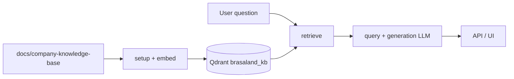

# RAG System Architecture & Design Document

**Company:** Brasaland  
**Audience:** Commercial and operations teams

## 1. Overview & RAG process flow

### End-to-end pipeline

1. **Source knowledge base** — Markdown policies and procedures in `docs/company-knowledge-base/` (see `CONTEXT-company.md` for the file list).
2. **Indexing (`data/process/rag.py`)**
   - `setup()` reads source documents, chunks by Markdown headings and paragraphs, embeds each chunk, and upserts vectors into Qdrant collection `brasaland_kb`.
   - `embed(text)` calls the dedicated embedding model via the 4Geeks gateway.
3. **Retrieval (`data/pipelines/rag.py`)**
   - `retrieve(query)` embeds the user question, queries Qdrant for top-*k* neighbors, and filters by `min_score`.
4. **Generation (`data/pipelines/rag.py`)**
   - `query(question)` assembles surviving chunks into a prompt, calls the separate generation model, and returns only the answer string.
5. **API** — `POST /knowledge/query` in `services/api/routers/knowledge.py`.
6. **UI** — `uis/knowledge/index.html` served at `/knowledge/`.



## 2. Chunking strategy

- **Approach:** Semantic section chunking on Markdown headings (`#`, `##`, …), then paragraph blocks within each section.
- **Rationale:** Preserves complete policies, conditional rules, and FAQ blocks without splitting mid-sentence.
- **Parameters:** Minimum 50 characters per chunk; oversized sections split near paragraph boundaries up to ~2000 characters.

## 3. Embedding & generation models

Configured separately in `.env` (never reuse the generation model for embeddings):

| Role | Env var | Default (4Geeks gateway) |
|------|---------|--------------------------|
| Embeddings | `EMBEDDING_MODEL_ID` | `downtown-miami/openrouter/perplexity/pplx-embed-v1-0.6b` |
| Generation | `GENERATION_MODEL_ID` | `downtown-miami/groq/llama-3.1-8b-instant` |

- **Vector metric:** Cosine similarity in Qdrant
- **Vector dimension:** `EMBEDDING_DIMENSION` (1024 for pplx-embed-v1-0.6b)
- **Similarity threshold:** `min_score = 0.69` (calibrated for `pplx-embed-v1-0.6b`; design target ~0.70)

## 4. Brasaland business rules in generation

- Answer only from retrieved context.
- Never claim zero allergen risk or 100% safety.
- Preserve USD $ / COP $ values exactly.
- Do not invent numbers or percentages.
- If context is insufficient: *"There is not enough information available."*

## 5. API & UI integration

| Component | Location |
|-----------|----------|
| `POST /knowledge/query` | `services/api/routers/knowledge.py` |
| Query UI | `uis/knowledge/index.html` → `http://localhost:8000/knowledge/` |
| Unit tests | `tests/pipelines/test_rag.py` |

**Request**

```json
{ "question": "What is the minimum stock rule for proteins?" }
```

**Response**

```json
{ "answer": "..." }
```

The UI shows loading and error states and never exposes raw vectors or similarity scores.

## 6. Local operations

```bash
docker compose up -d qdrant
uv sync
uv run python data/process/rag.py          # index corpus
uv run uvicorn api.app:app --reload       # API + UI
uv run pytest tests/pipelines/test_rag.py -v
```
