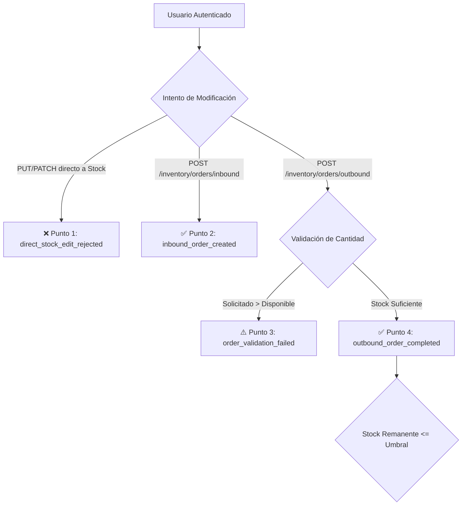

# Plan de Telemetría: Nexova Solutions

> **Versión:** 1.0.0  
> **Estado:** Propuesta Técnica de Diseño (RFI Response)  
> **Área:** AI Engineering & Core Architecture  
> **Empresa:** Nexova Solutions (Talent Consulting, Support Outsourcing & Corporate Training)

---

## 1. Resumen Ejecutivo y Objetivos del Sistema

Nexova Solutions gestiona operaciones críticas distribuidas en Selección de Talento, Soporte al Cliente Externalizado y Formación Corporativa, soportadas por un backend FastAPI y base de datos relacional. Hasta la fecha, el comportamiento del sistema y la actividad operativa han permanecido como "cajas negras", provocando:
- Desviaciones en SLAs de soporte (resolución promedio en 48h frente al compromiso de 24h).
- Falta de visibilidad sobre la efectividad del scoring de candidatos con IA.
- Ausencia de auditoría en tiempo real sobre intentos no autorizados de modificación de stock o fallos de validación en inventario.
- Incapacidad para detectar latencias y abandonos en los flujos del backoffice.

Este plan define la arquitectura de instrumentación para capturar datos accionables mediante una taxonomía unificada, envolturas estándar (*Event Envelopes*) y canales diferenciados de entrega (*Stream* y *Batch*).

---

## 2. Métricas Obligatorias (Línea Base del Negocio)

Alineadas con los desafíos inmediatos definidos en `CONTEXT-company.md`:

| Métrica Obligatoria | Departamento | Descripción y Meta Operativa |
| :--- | :--- | :--- |
| **Tiempo Medio de Resolución (MTTR)** | Soporte al Cliente | Reducir el tiempo de resolución de 48h actuales a < 24h (SLA contractual). |
| **Tasa de Automatización Chatbot** | Soporte al Cliente | Alcanzar un 40% de incidencias resueltas de forma autónoma sin escalar a agente. |
| **Distribución y Eficiencia de Scoring IA** | Selección de Talento | Medir el volumen de CVs evaluados y el tiempo promedio que ahorra el consultor. |
| **Tasa de Cumplimiento de Inventario** | Operaciones / IT | Auditar el 100% de movimientos de stock asegurando trazabilidad por órdenes. |

---

## 3. Mapeo del Flujo de Inventario (5 Puntos Críticos)

El sistema impone una regla innegociable: **el stock no se modifica directamente, solo a través de órdenes de entrada y salida trazables a un usuario**. Los puntos de instrumentación clave son:

### Detalle y Justificación de los 5 Puntos Críticos

A continuación se define la justificación de cada punto crítico aplicando la regla de oro:

#### 1. `direct_stock_edit_rejected` (Seguridad / Integridad)
- **Momento de captura:** Cuando una petición intenta mutar directamente el campo de stock vía `PUT/PATCH` saltándose el ciclo de órdenes.
- **Hipótesis:** *"Necesitamos saber si existen clientes desactualizados, scripts no autorizados o intentos maliciosos de saltarse la auditoría de inventario."*
- **Decisión:** *"Permite bloquear IPs/usuarios reincidentes y detectar endpoints legados que requieran refactorización inmediata."*

#### 2. `inbound_order_created` (Operaciones / Abastecimiento)
- **Momento de captura:** Al registrar y validar una orden de entrada de stock proveniente de un proveedor.
- **Hipótesis:** *"Necesitamos medir el volumen, frecuencia y tiempo de procesamiento del reabastecimiento de insumos."*
- **Decisión:** *"Permite evaluar el rendimiento de los proveedores y planificar el espacio de almacén."*

#### 3. `order_validation_failed` (UX / Operaciones)
- **Momento de captura:** Cuando falla la creación de una orden saliente (ej. cantidad solicitada mayor a la disponible o SKU inválido).
- **Hipótesis:** *"Necesitamos identificar qué productos causan más fricción en el backoffice y si los operadores intentan despachar ítems sin disponibilidad real."*
- **Decisión:** *"Permite agregar advertencias visuales proactivas en la interfaz para que el usuario no envíe formularios inviables."*

#### 4. `outbound_order_completed` (Negocio / Cumplimiento)
- **Momento de captura:** Al confirmarse la deducción y despacho del stock asignado a una orden de salida.
- **Hipótesis:** *"Necesitamos conocer la tasa de cumplimiento de pedidos y la velocidad real de rotación del inventario."*
- **Decisión:** *"Permite dimensionar turnos de operadores y garantizar que no haya desfases entre stock contable y físico."*

#### 5. `stock_threshold_triggered` (Alerta Operativa / Resiliencia)
- **Momento de captura:** Inmediatamente después de que una orden saliente deja el stock remanente en o por debajo del umbral mínimo de seguridad.
- **Hipótesis:** *"Necesitamos saber qué productos de alta rotación están al borde de la rotura de stock."*
- **Decisión:** *"Permite generar automáticamente órdenes de compra preventivas o alertar a compras antes de perder ventas/servicios."*

---

## 4. Catálogo Exhaustivo de Oportunidades de Datos

A continuación se presenta el catálogo formal de eventos propuestos para Nexova Solutions. Cada evento cumple con la taxonomía uniforme `entidad_acción` en minúsculas y está sustentado bajo la regla de oro:
> *"Capturamos `[event_type]` porque necesitamos saber `[hipótesis]`, lo que nos permite tomar la decisión `[decisión]`."*

### Tabla Maestra del Catálogo de Eventos

| Event Type | Categoría | Clasificación | Hipótesis | Decisión Asociada |
| :--- | :--- | :--- | :--- | :--- |
| `support_ticket_resolved` | Soporte al Cliente | **Obligatorio (Contexto)** | Medir la duración total desde la apertura hasta el cierre del ticket para verificar el SLA contractual de 24h. | Reasignar personal de soporte en picos de demanda o reestructurar colas de atención para evitar penalizaciones contractuales. |
| `chatbot_issue_resolved` | Soporte al Cliente | **Obligatorio (Contexto)** | Conocer la proporción de consultas resueltas directamente por el bot sin intervención humana (meta: 40%). | Optimizar los prompts y la base de conocimiento del chatbot para ampliar los casos auto-resueltos. |
| `candidate_score_calculated` | Selección de Talento | **Obligatorio (Contexto)** | Evaluar la distribución de puntuaciones (0-100) y el tiempo ahorrado por el consultor al no revisar CVs manualmente. | Ajustar los criterios de cribado semántico y priorizar candidatos de alto potencial en los primeros 2 días de la vacante. |
| `inventory_compliance_audited` | Operaciones / IT | **Obligatorio (Contexto)** | Comprobar que el 100% de los movimientos de stock corresponden a órdenes aprobadas y trazadas. | Suspender cuentas o restringir permisos si se detectan anomalías de balance contable/físico no justificadas. |
| `direct_stock_edit_rejected` | Inventario / Seguridad | **Oportunidad Identificada** | Detectar peticiones HTTP anómalas que intentan modificar stock por vías no autorizadas. | Bloquear endpoints o IPs reincidentes y auditar posibles brechas en el control de acceso. |
| `inbound_order_created` | Inventario / Operaciones | **Oportunidad Identificada** | Monitorizar el volumen y frecuencia con la que los proveedores abastecen almacenes. | Evaluar la puntualidad de proveedores y reprogramar entregas para evitar saturación de espacio. |
| `order_validation_failed` | Inventario / UX | **Oportunidad Identificada** | Detectar intentos recurrentes de crear órdenes con stock insuficiente o datos erróneos. | Añadir validaciones anticipadas en el cliente web y advertencias visuales de stock bajo. |
| `outbound_order_completed` | Inventario / Negocio | **Oportunidad Identificada** | Medir el volumen real de despachos y el tiempo de ciclo desde la orden hasta la expedición. | Dimensionar los turnos de empaque y logística según las horas pico de salida. |
| `stock_threshold_triggered` | Inventario / Resiliencia | **Oportunidad Identificada** | Conocer qué artículos de alta rotación caen por debajo del stock mínimo de seguridad. | Disparar órdenes de compra preventivas automatizadas a proveedores antes de la rotura de stock. |
| `auth_login_succeeded` | Autenticación / Seguridad | **Oportunidad Identificada** | Conocer los patrones de inicio de sesión legítimos, roles y horarios de los operadores. | Mantener auditoría de accesos y calibrar políticas de retención de tokens de autenticación. |
| `auth_login_failed` | Autenticación / Seguridad | **Oportunidad Identificada** | Detectar ráfagas de credenciales inválidas que indiquen ataques de fuerza bruta o problemas de usabilidad. | Activar rate limiting por IP, bloqueo temporal de cuenta o requerir desafío MFA adicional. |
| `user_session_expired` | Autenticación / UX | **Oportunidad Identificada** | Medir cuántos operadores pierden su sesión activa mientras interactúan con el backoffice. | Ajustar el TTL del refresh token o implementar advertencia visual previa a la expiración. |
| `api_latency_recorded` | Rendimiento / Sistema | **Oportunidad Identificada** | Monitorizar los tiempos de respuesta (p95 y p99) de los servicios FastAPI y Supabase. | Iniciar optimizaciones de caching (Redis/InMemory), índices de base de datos o escalado vertical. |
| `client_unhandled_error_captured` | Errores / Frontoffice | **Oportunidad Identificada** | Capturar excepciones JavaScript no manejadas en el navegador de los operadores. | Identificar navegadores problemáticos o regresiones de frontend para desplegar hotfixes rápidamente. |
| `database_query_slow_detected` | Rendimiento / BD | **Oportunidad Identificada** | Identificar queries de base de datos que superan los 500ms en operaciones de inventario o tickets. | Optimizar consultas SQL, reescribir queries pesadas o crear índices compuestos. |
| `funnel_step_abandoned` | Navegación / Backoffice | **Oportunidad Identificada** | Identificar en qué paso exacto los consultores o agentes abandonan un flujo (ej. creación de orden o scoring). | Rediseñar formularios extensos, simplificar campos requeridos o guardar borradores automáticos. |
| `candidate_score_card_expanded` | Selección / UX | **Oportunidad Identificada** | Analizar con qué frecuencia los consultores despliegan el acordeón con el razonamiento detallado de la IA. | Determinar si la explicación del modelo aporta valor o si el resumen visual es suficiente. |
| `support_ticket_escalated` | Soporte al Cliente | **Oportunidad Identificada** | Conocer las razones y categorías donde el chatbot no logra resolver y transfiere a un humano. | Actualizar la base de preguntas frecuentes y entrenar al chatbot en los tópicos con mayor tasa de escalado. |
| `filter_applied` | Navegación / Backoffice | **Oportunidad Identificada** | Identificar qué filtros y combinaciones de búsqueda son más utilizados por los operadores. | Pre-computar índices en base de datos para los filtros más comunes y guardar vistas predeterminadas. |

---

## 5. Diseño del Event Envelope y Privacidad de Datos

Para garantizar la interoperabilidad transversal y la trazabilidad de extremo a extremo (Frontend SPA ↔ FastAPI ↔ Supabase), todos los eventos emitidos deben adherirse a un **Event Envelope** universal e inmutable.

### 5.1 Campos Troncales del Event Envelope

El envelope se define con 7 campos canónicos más el objeto restrictivo `properties`:

| Campo | Tipo | Requerido | Descripción | Ejemplo |
| :--- | :--- | :--- | :--- | :--- |
| `eventId` | `string (UUID v4)` | Sí | Identificador único global de la ocurrencia del evento. | `"c8f1f72a-9b43-41a6-9810-7e4d293cf781"` |
| `timestamp` | `string (ISO 8601 UTC)` | Sí | Marca temporal en precisión milisegundos con sufijo UTC `Z`. | `"2026-10-08T21:40:00.123Z"` |
| `sessionId` | `string (UUID/Token)` | Sí | Identificador de la sesión de navegación del operador/usuario. | `"sess_89f02c4b-12d4-4a5e-8b65-e320917498c1"` |
| `userId` | `string (nullable)` | Sí | Hash SHA-256 del ID interno del usuario, o `null` si es una acción anónima/pre-login. | `"e3b0c44298fc1c149afbf4c8996fb92427ae41e4649b934ca495991b7852b855"` |
| `event_type` | `string` | Sí | Nombre canónico bajo taxonomía `entidad_acción` en minúsculas con snake_case. | `"stock_threshold_triggered"` |
| `schemaVersion` | `string` | Sí | Versión semántica del esquema del evento para control de compatibilidad. | `"1.0.0"` |
| `requestId` | `string (UUID v4)` | Sí | Identificador de correlación distribuida propagado en encabezados HTTP (`X-Request-ID`). | `"9a1b65e0-47b2-4d2c-80bb-698f12a3d077"` |
| `properties` | `object` | Sí | Payload específico del evento regulado estrictamente por su correspondiente Allowlist. | `{ "sku": "NX-SRV-01", "current_stock": 2 }` |

### 5.2 Política Estricta de Allowlists de Propiedades

Para prevenir fugas accidentales de datos y mantener esquemas deterministas, se aplica la regla de **esquema cerrado** (`additionalProperties: false`). A continuación se detallan los allowlists de los eventos nucleares:

#### A. Métricas Obligatorias (Línea Base del Negocio)
1. **`support_ticket_resolved`**
   - `ticket_id` (`string`, UUID): Identificador del ticket.
   - `resolution_time_minutes` (`integer`, min: 0): Tiempo total de resolución en minutos.
   - `channel` (`string`, enum: `["chat", "email", "phone"]`): Canal de atención.
   - `agent_id_hash` (`string`, SHA-256): Hash del operador que cerró el ticket.
   - `sla_breached` (`boolean`): Si superó el SLA contractual de 24 horas (1440 min).
2. **`chatbot_issue_resolved`**
   - `conversation_id` (`string`, UUID): Identificador de la conversación del bot.
   - `category` (`string`, enum: `["tech_support", "billing", "onboarding", "general"]`): Categoría de la consulta.
   - `message_count` (`integer`, min: 1): Cantidad de intercambios hasta la resolución.
   - `satisfaction_score` (`integer`, min: 1, max: 5, nullable): Calificación otorgada por el usuario.
   - `resolution_type` (`string`, enum: `["faq_matched", "workflow_completed", "self_service"]`): Mecanismo de resolución.
3. **`candidate_score_calculated`**
   - `candidate_id_hash` (`string`, SHA-256): Hash del ID del candidato.
   - `job_position_id` (`string`, UUID): ID de la vacante evaluada.
   - `score_value` (`number`, min: 0, max: 100): Puntuación otorgada por el modelo.
   - `model_version` (`string`): Versión del agente/algoritmo semántico.
   - `calculation_duration_ms` (`integer`, min: 0): Latencia de cálculo en milisegundos.
4. **`inventory_compliance_audited`**
   - `audit_run_id` (`string`, UUID): Identificador de la corrida de auditoría.
   - `discrepancy_count` (`integer`, min: 0): Número de SKUs con discrepancias detectadas.
   - `total_checked_skus` (`integer`, min: 1): Total de SKUs auditados.
   - `compliance_rate_percent` (`number`, min: 0, max: 100): Porcentaje de stock cumplido.
   - `flagged_items` (`array` de strings): Lista de SKUs que presentaron alertas.

#### B. Flujo de Inventario (5 Puntos Críticos)
1. **`direct_stock_edit_rejected`**: `endpoint_attempted` (`string`), `method` (`string`), `user_role` (`string`), `target_sku` (`string`), `rejection_reason` (`string`).
2. **`inbound_order_created`**: `order_id` (`string`, UUID), `supplier_id_hash` (`string`, SHA-256), `sku_list_count` (`integer`), `total_units` (`integer`), `expected_delivery_date` (`string`, date).
3. **`order_validation_failed`**: `order_id` (`string`, UUID), `order_type` (`string`, enum: `["inbound", "outbound"]`), `sku` (`string`), `requested_quantity` (`integer`), `available_quantity` (`integer`), `error_code` (`string`).
4. **`outbound_order_completed`**: `order_id` (`string`, UUID), `destination_department` (`string`), `item_count` (`integer`), `total_units_dispatched` (`integer`), `fulfillment_duration_seconds` (`integer`).
5. **`stock_threshold_triggered`**: `sku` (`string`), `current_stock` (`integer`), `minimum_threshold` (`integer`), `replenishment_recommended` (`boolean`), `warehouse_id` (`string`).

#### C. Eventos Adicionales de Infraestructura y Backoffice
1. **`auth_login_succeeded`**: `user_id_hash` (`string`, SHA-256), `auth_method` (`string`, enum: `["password", "sso"]`), `user_role` (`string`), `client_ip_hash` (`string`, SHA-256).
2. **`auth_login_failed`**: `failure_reason` (`string`), `attempt_number` (`integer`), `client_ip_hash` (`string`, SHA-256), `user_agent_category` (`string`).
3. **`user_session_expired`**: `session_duration_minutes` (`integer`), `last_active_route` (`string`), `user_role` (`string`).
4. **`api_latency_recorded`**: `endpoint` (`string`), `http_method` (`string`), `status_code` (`integer`), `response_time_ms` (`integer`), `db_queries_count` (`integer`).
5. **`client_unhandled_error_captured`**: `error_name` (`string`), `error_message_sanitized` (`string`), `current_url` (`string`), `stack_trace_hash` (`string`, SHA-256).
6. **`database_query_slow_detected`**: `table_name` (`string`), `operation` (`string`), `duration_ms` (`integer`), `query_signature_hash` (`string`, SHA-256).
7. **`funnel_step_abandoned`**: `funnel_name` (`string`), `step_number` (`integer`), `step_name` (`string`), `time_spent_seconds` (`integer`).
8. **`candidate_score_card_expanded`**: `candidate_id_hash` (`string`, SHA-256), `job_position_id` (`string`, UUID), `time_viewing_seconds` (`integer`).
9. **`support_ticket_escalated`**: `ticket_id` (`string`, UUID), `conversation_id` (`string`, UUID), `escalation_reason` (`string`), `unresolved_category` (`string`).
10. **`filter_applied`**: `view_name` (`string`), `filter_keys` (`array` de strings), `active_filters_count` (`integer`), `results_count` (`integer`).

### 5.3 Protección de Datos Sensibles (PII) y Anonimización

Nexova Solutions está sujeta al RGPD (Reglamento General de Protección de Datos de la UE). Toda información identificativa debe ser anonimizada antes de ser inyectada al pipeline de telemetría:
1. **Hashing Criptográfico Unidireccional:** Todo `userId`, `candidate_id`, `supplier_id`, correo electrónico, número telefónico e IP del cliente debe pasar por una función `SHA-256(sal_secreta + valor)` en el punto de emisión.
2. **Sanitización de Cadenas de Texto:** Los campos de texto libre (como mensajes de error de cliente) se filtran con expresiones regulares para erradicar tokens Bearer, contraseñas, números de tarjeta de crédito y patrones de emails.
3. **Exclusión Absoluta:** Queda prohibido emitir passwords en texto plano, hashes de contraseñas de BD, tokens JWT completos, el contenido íntegro de currículums o notas médicas/personales de empleados o candidatos.

---

## 6. Estrategia de Entrega (Stream vs. Batch) y Políticas de Resiliencia

No todos los datos demandan la misma inmediatez de procesamiento. Diferenciar las vías de ingesta evita sobrecargar la infraestructura analítica y minimiza costes de computación.

### 6.1 Clasificación Stream vs. Batch

| Tipo de Entrega | Latencia Objetivo | Justificación de Negocio y Criterio Técnico | Eventos Asignados |
| :--- | :--- | :--- | :--- |
| **Stream (Tiempo Real)** | < 3 segundos | **Alertas críticas y mitigación de riesgos inmediatos.** Se requiere acción operativa inmediata para evitar roturas de stock, brechas de seguridad o caídas de SLAs contractuales. | • `direct_stock_edit_rejected` • `stock_threshold_triggered` • `auth_login_failed` • `support_ticket_escalated` • `client_unhandled_error_captured` |
| **Batch (Por Lotes)** | Lotes cada 5 a 15 min (o consolidado diario) | **Métricas analíticas, reportería directiva y evaluación histórica.** No demandan reacción al segundo; procesarlos en micro-lotes reduce el consumo de red, memoria y costos de storage. | • `support_ticket_resolved` (MTTR) • `chatbot_issue_resolved` • `candidate_score_calculated` • `inventory_compliance_audited` • `inbound_order_created` • `order_validation_failed` • `outbound_order_completed` • `auth_login_succeeded` • `user_session_expired` • `api_latency_recorded` • `database_query_slow_detected` • `funnel_step_abandoned` • `candidate_score_card_expanded` • `filter_applied` |

### 6.2 Políticas de Mitigación de Volumen (Throttling y Debouncing)

Para prevenir la saturación de los canales de telemetría ante eventos de alta frecuencia:
- **Throttling (Límites de Tasa):**
  - `api_latency_recorded`: Se aplica un muestreo estadístico determinista del 10% para respuestas exitosas (`HTTP 200/201`), pero se preserva el **100% de captura para respuestas con errores 4xx y 5xx**.
  - `auth_login_failed`: Se permite un máximo de 5 emisiones por IP por minuto antes de agrupar los eventos en un reporte consolidado de anomalía de red.
- **Debouncing (Ventanas de Calma):**
  - `filter_applied`: Se establece un debounce de **500 ms** en la interfaz para esperar que el usuario termine de seleccionar filtros o tipear en el buscador antes de emitir el evento.
- **Circuit Breaker y Buffer Local:**
  - Los clientes de telemetría (navegador o backend) mantendrán un búfer en memoria (o IndexedDB en cliente) de hasta 100 eventos. Si el servicio colector no responde, los eventos se almacenan temporalmente y se reintentan con retroceso exponencial (*exponential backoff*), descartando eventos Batch más antiguos si el buffer supera los 5 MB.

---

## 7. Análisis de Riesgos, Exclusiones y Restricciones Éticas

La telemetría indiscriminada degrada el rendimiento de la aplicación y expone a la empresa a severas contingencias legales.

### 7.1 Eventos y Mecanismos Evaluados y Descartados

| Mecanismo / Evento Descartado | Motivo del Descarte | Impacto Negativo Evitado |
| :--- | :--- | :--- |
| **Keylogging / Tracking por tecla en formularios** | Riesgo crítico de captura involuntaria de contraseñas, datos bancarios o PII de candidatos. | Infracción gravísima de RGPD y pérdida de confianza de los empleados. |
| **Heatmaps continuos y tracking de mouse continuo** | Genera un volumen masivo de datos irrelevantes (gigabytes de coordenadas X/Y) con mínimo valor de negocio. | Saturación del ancho de banda del usuario y sobrecoste de almacenamiento en la nube. |
| **Transcripción íntegra de conversaciones de soporte en telemetría** | Los mensajes de clientes contienen frecuentemente nombres, direcciones y datos personales. | Duplicación innecesaria de almacenamiento y exposición masiva de PII en logs de analítica. El texto vive en la base de datos de producción con cifrado en reposo. |
| **Captura de pantalla de sesión (Session Replay completo)** | Alto coste de procesamiento en el cliente y riesgo de grabar información confidencial en pantalla. | Degradación de FPS en la máquina del operador y riesgos de privacidad laboral. |

### 7.2 Garantías de Cumplimiento Ético y Legal

1. **Minimización de Datos (Data Minimization):** Solo se capturan los datos indispensables y definidos en el allowlist estricto de cada esquema.
2. **Propósito Específico:** Cada métrica responde a una hipótesis operativa demostrada y a una decisión ejecutable.
3. **Derecho al Olvido:** Al estar todos los identificadores anonimizados mediante hashes salted irreversibles, la correlación analítica no permite reidentificar a un usuario si este solicita la supresión de sus datos en los sistemas operacionales.
