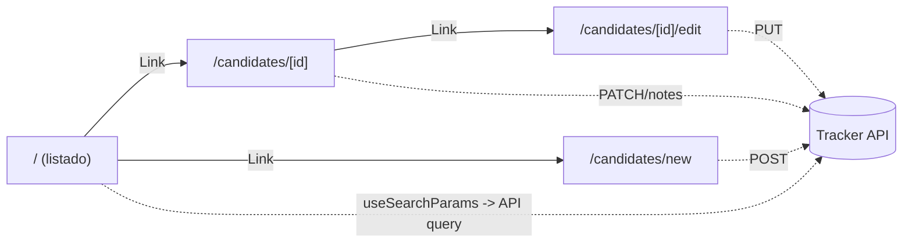
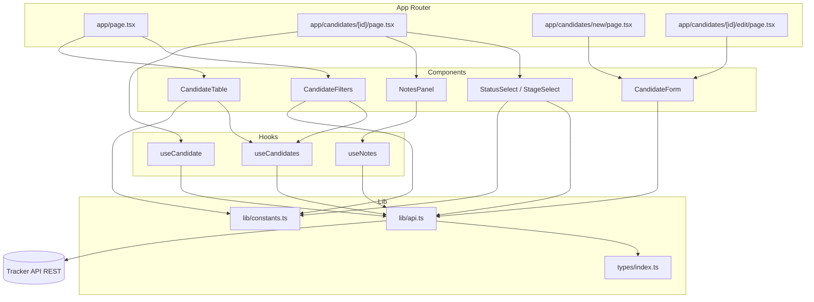
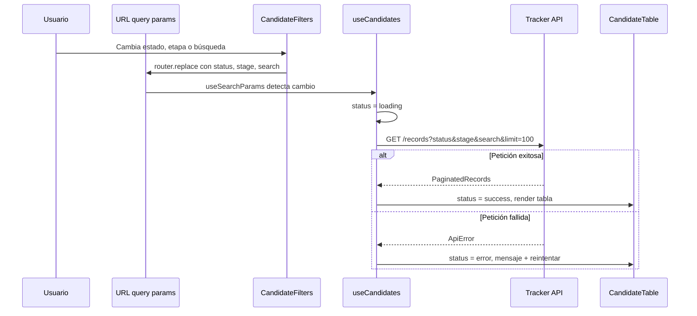
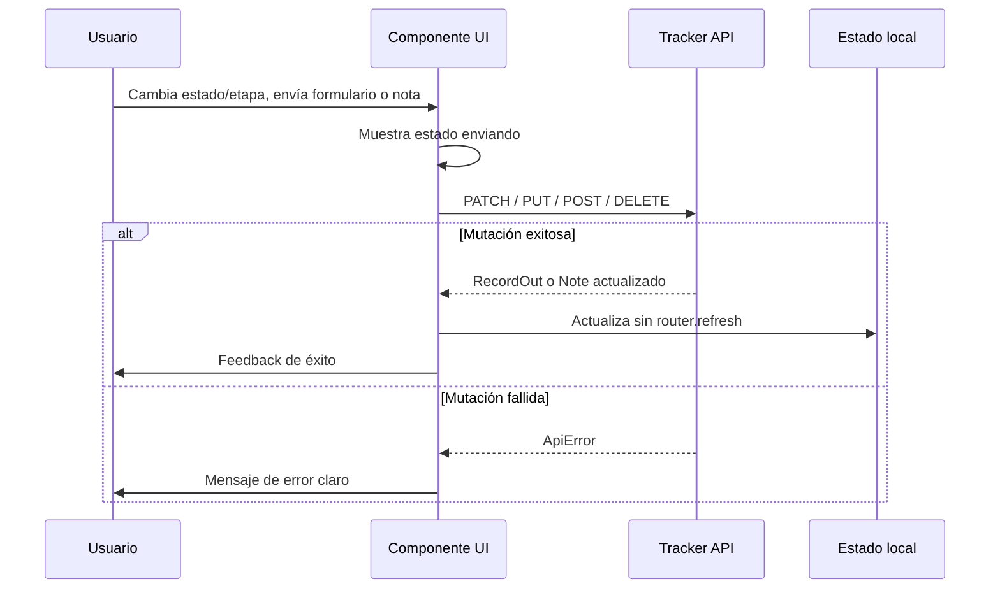
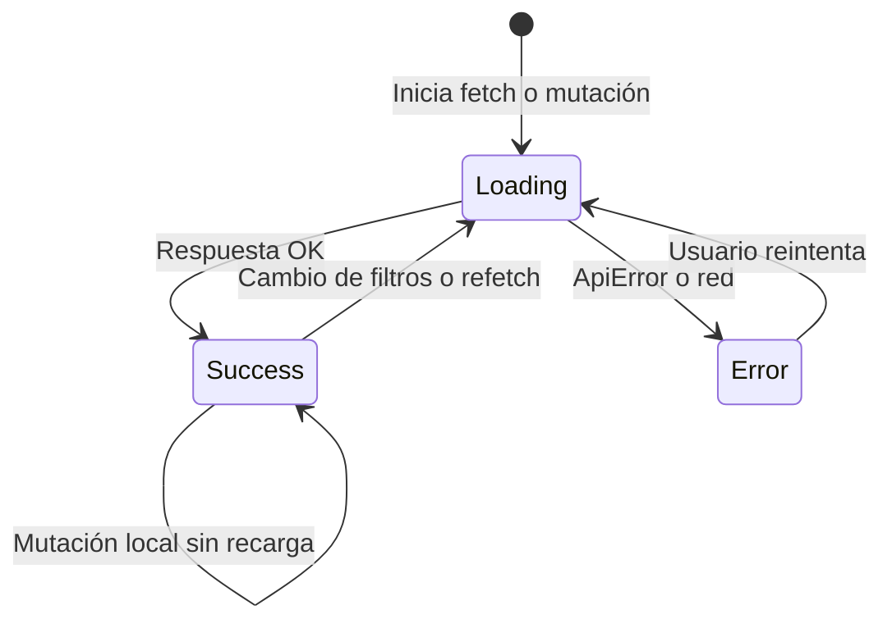

# Talent Pipeline Tracker — Implementación

Documentación del Hito 3: frontend del pipeline de candidaturas para el equipo de **People & Talent de Brasaland**.

**Stack:** Next.js 16 (App Router) + React 19 + TypeScript + Tailwind v4  
**Estado:** Implementado

---

## Contexto de dominio (Brasaland)

La UI es una herramienta interna del equipo de **People & Talent de Brasaland** (cadena de asados, 14 locales en Colombia y Florida). Idioma **español**, branding Brasaland. Los nombres de campo de la API se conservan, pero las **etiquetas visibles, estados y etapas** se muestran traducidos:

- Status: `received`=Recibida, `in_progress`=En proceso, `selected`=Seleccionada, `discarded`=Descartada.
- Stage: `pending`=Pendiente, `review`=En revisión, `personal_interview`=Entrevista personal, `technical_interview`=Entrevista técnica, `offer_presented`=Oferta presentada.

## API (contrato confirmado)

Base `NEXT_PUBLIC_API_URL=https://playground.4geeks.com/tracker/api/v1`.

- `GET /records?status&stage&search&page&limit` → `{ total, page, limit, data: RecordOut[] }`.
- `GET /records/:id` → `RecordOut` (incluye `notes[]`). `POST /records` (201), `PUT /records/:id`, `PATCH /records/:id` (`{status?, stage?}`), `DELETE /records/:id` (204).
- `GET/POST /records/:id/notes`, `DELETE /records/:id/notes/:note_id`.
- `RecordOut`: `id, full_name, email, phone, position, linkedin_url, cv_url, status, stage, experience_years, notes_count, applied_at, updated_at`.
- `RecordCreate` requeridos: `full_name, email, phone, position, experience_years`.

## Arquitectura

Enfoque **client-side fetching** (cumple `async/await` + estados carga/éxito/error y actualización sin recarga). Páginas delgadas que montan componentes cliente; los filtros del listado viven en la URL vía `useSearchParams` y se envían como query params al API.

### Navegación entre rutas

### Capas del frontend

### Flujo de datos del listado

### Flujo de mutaciones sin recarga

### Estados async en la UI

## Estructura de carpetas

- `types/index.ts` — tipos `RecordOut`, `Note`, `RecordCreate`, `RecordPatch`, `PaginatedRecords`, uniones `Status`/`Stage`.
- `lib/api.ts` — wrapper `request()` con `async/await`, manejo de errores (lanza `ApiError` con status/detalle) y funciones tipadas (`getRecords`, `getRecord`, `createRecord`, `updateRecord`, `patchRecord`, `deleteRecord`, `getNotes`, `addNote`, `deleteNote`).
- `lib/constants.ts` — arrays `STATUS_OPTIONS`/`STAGE_OPTIONS` con `{value,label}` y mapas de color para badges.
- `hooks/` — `useCandidates` (lista + filtros), `useCandidate` (detalle), `useNotes`.
- `components/` — `Header`, `CandidateFilters` (estado, etapa, búsqueda con debounce), `CandidateTable`/`CandidateRow`, `StatusBadge`, `StageBadge`, `StatusSelect`, `StageSelect`, `NotesPanel`, `CandidateForm` (reusado en alta/edición), `Alert`, `Spinner`/`LoadingState`, `ErrorState`, `EmptyState`.

## Rutas (`app/`)

- `app/layout.tsx` — root layout Brasaland (metadata, header, español, Tailwind).
- `app/page.tsx` — listado; monta `CandidateFilters` + `CandidateTable`. Lee filtros con `useSearchParams`, refleja cambios con `useRouter().replace()`; fetch al API con esos params; estados carga/error/vacío.
- `app/candidates/[id]/page.tsx` — detalle (client, `useParams`): todos los campos, `StatusSelect`/`StageSelect` con `PATCH`, panel de notas (`GET/POST/DELETE`), enlaces a LinkedIn/CV, botón Editar.
- `app/candidates/new/page.tsx` — `CandidateForm` en modo alta (`POST`), validación de requeridos, feedback y redirección al detalle.
- `app/candidates/[id]/edit/page.tsx` — `CandidateForm` precargado (`PUT`), validación y feedback.

## Detalles de implementación

- **Filtros/búsqueda**: `CandidateFilters` actualiza query params (`status`, `stage`, `search`) sin recargar; búsqueda con debounce; el hook re-fetchea al cambiar params. Se usa `limit` alto (p.ej. 100) para "ver todas de un vistazo".
- **Mutaciones sin recarga**: tras `PATCH`/`POST`/notes, se actualiza el estado local con la respuesta del API (no `router.refresh()` completo).
- **Estados UI**: cada fetch expone `loading | data | error`; errores muestran mensaje claro y opción de reintentar; formularios muestran feedback de éxito/error y estado enviando.
- **Validación**: en `CandidateForm`, requeridos (`full_name`, `email` con formato, `phone`, `position`, `experience_years` numérico ≥ 0) antes de enviar; `linkedin_url`/`cv_url` opcionales validando URL si se ingresan.
- **Config**: `.env.local` con `NEXT_PUBLIC_API_URL` y fallback a la URL en `lib/api.ts`. Metadata actualizada en `layout.tsx`.

## Verificación

- `npm run dev` — probar flujos en local.
- `npm run lint` — sin errores de ESLint.
- `npm run build` — compilación de producción exitosa.

## Tareas completadas

1. **types-lib** — `types/index.ts`, `lib/api.ts`, `lib/constants.ts`, `.env.local`
2. **layout-header** — `app/layout.tsx` con branding Brasaland y `Header`
3. **shared-components** — badges, estados de carga/error/vacío, `Alert`
4. **list-page** — listado con filtros, búsqueda y tabla de candidaturas
5. **detail-page** — detalle con PATCH de estado/etapa y panel de notas
6. **forms** — alta y edición de candidaturas con validación
7. **verify** — lint y build verificados
